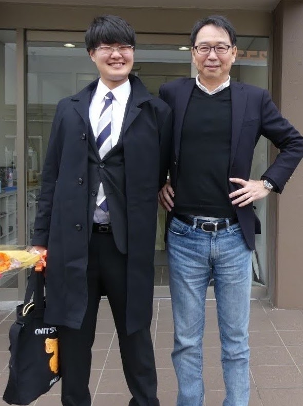

# 樋口 颯人（Higuchi Hayato）
株式会社QuanSysリサーチ事業部のリサーチャーです。流体シミュレーションの量子アルゴリズム研究に取り組んでいます。博士時代はオーロラシミュレーションやプラズマシミュレーションの量子アルゴリズム開発に取り組んでいました。趣味は競技かるたと筋トレです。

***

## Programming Languages
`Python` `Julia` `Matlab` `C` `FORTRAN` `HTML`

## Frameworks / Libraries
`Qiskit``Qulacs`

## Environments
`Visual Studio Code` `Emacs`

## Other Skills
`美味しいお店探し` `競技かるたA級5段`

## Qualifications
`博士（理学）取得予定` `普通自動車第一種運転免許`

## Job Experience
### *2013.7 ~*
**星の館(天文台)スタッフ**
> - *ボランティア*
> - 宇宙や星の解説並びに講演担当
> - 天文台の操作、望遠鏡のメンテナンス

### *2017.4 - 2021.2*
**ホテルフロントスタッフ**
> - *アルバイト*
> - 夜間フロント責任者に昇格
> - 接客のノウハウを学んだ

### *2021.1 - 2022.1*
**ECサイト制作**
> - *アルバイト*
> - Shopifyを使ったECサイト構築及び運用
> - ２件の企業サイトを受託

## Research Experience
### Position: Ph.D student of Space-Earth Electromagnetism Laboratory, Kyushu University
### *2020.4 - 2022.3*
**Poleward Boundary Intensificationを再現するためのオーロラ電子加速シミュレーション開発**
> - *修士課程研究*
> - Juliaを用いた電磁プラズマ流体方程式と衝突性Hall MHDのハイブリッド数値計算モデル開発
> - オーロラ粒子として十分な粒子加速を得た
> - PDF:[Master Paper.pdf](https://github.com/Hayato-Higuchi/portfolio/blob/main/%E4%BF%AE%E5%A3%AB%E8%AB%96%E6%96%872022_%E6%A8%8B%E5%8F%A3%E9%A2%AF%E4%BA%BA.pdf)

### *2021.6 ~*
**量子誤り耐性量子コンピュータを用いた太陽-地球間の大規模宇宙プラズマ環境予測シミュレータの開発**
> - *博士課程研究*
> - 量子回路シミュレータQiskitを使って量子アルゴリズムを構築・検証
> - 世界初、太陽系の非線形宇宙プラズマシミュレータ(Boltzmann-Maxwell方程式)の量子計算アプリケーションを開発

### *2023.5 ~* 
**深宇宙探査の観測データ圧縮問題を解決する量子センシングとシミュレーションデータ同化構想**
> - *博士課程研究*
> - 量子回路シミュレータQiskitを使って量子データ変換量子アルゴリズムを構築・検証
> - 深宇宙探査機の高解像度観測データをシミュレーションインプットにマッピング、平滑化

### *2024.4 ~ 7* 
**オーストリア科学アカデミー宇宙研究所にて運動論的プラズマシミュレーション・惑星探査の研究滞在**
> - 深宇宙探査プロジェクトの観測データやシミュレーション研究の調査、ディスカッション
> - 宇宙機その場観測のreconstraction問題の量子コンピューティング応用を議論

### *2024.10 ~ 12* 
**カルフォリニア大学バークレー校宇宙科学研究所にて太陽プラズマシミュレーションの研究滞在**
> - 太陽探査プロジェクトのX線観測手法やPICシミュレーション研究の調査、ディスカッション
> - 太陽探査の量子コンピューティング応用を議論

### *2019.10 ~*
**MAGnetic Data Acquisition System(MAGDAS)プロジェクトのサポート**
> - *研究室プロジェクト*
> - 全球的地磁気地上磁場観測ネットワーク[MAGDAS](http://magdas2.serc.kyushu-u.ac.jp) の磁力計を設置、運用、保守、点検のサポート
> - 観測データのMatlab解析

## Awards and honors
> - 2012年度先端科学技術体験合宿科学講座３優秀賞受賞
> - 2015年度九州大学理学部主催エクセレントスチューデントインサイエンス(物理学)にて最優秀賞受賞
> - 2019年度全国大学かるた大会団体戦において89校中全国4位を獲得(九州大学代表メンバー主将)
> - 2023年度量子ネイティブシンポジウムにて学生優秀発表賞受賞
> - (Invited) Higuchi, H, J. W. Pedersen and A. Yoshikawa, Quantum Calculation for Kinetic Multi-scale Auroral Mechanism: A Novel Approach to Numerical Analysis from Kinetic Alfvén Wave Scales to MHD Scales, American Geophysical Union Fall Meeting 2023, 2023.12.11, Oral
> - (Invited) Higuchi, H, J. W. Pedersen, K. Toyoizumi, K. Yoshikawa, C. Kiumi, A. Yoshikawa, Quantum Computing for Space Plasma Simulations, 1st International Workshop on Quantum Cryogenic and Superconductive Computing (QUEST2024), 2024.9.10, Oral
> - (Invited) Higuchi, H, Y. Ito, K. Sakamoto, K. Fujii, J. W. Pedersen, A. Yoshikawa, A Quantum Algorithm for Nonlinear Electromagnetic Fluid Dynamics via Koopman-von Neumann Linearization: 2D Numerical Validation with Qulacs, 51th European Physical Society Quantum Computing for Plasma Physics Satellite Meeting, 2025.07.12, Oral
> - (Invited) 樋口颯人, 伊藤優輝, 坂本一樹, 藤井啓祐, 吉川顕正, Koopman-von Neumann線形化した非線形電磁流体力学の量子アルゴリズム, 第２回Quantum CAE研究会, 2025.05.08, 口頭

## Grants
> -	2021年度九州大学院研究支援奨学金に採択
> -	2022年度年度九州大学先導的人材育成フェローシップ事業研究奨励金(量子分野)に採択
> - 2023年度未踏ターゲット事業(量子コンピュータを活用したソフトウェア開発分野)の書類選考通過、最終選考のヒアリング審査進出
> - 2023年度SGEPSS国際学術交流事業 国際学術交流若手派遣 採択

## Education
### *2013.4 - 2016.3*
> 福岡県立筑紫丘高等学校　理数科
### *2016.4 - 2020.3*
> 九州大学　理学部　物理学科
### *2020.4 - 2022.3*
> 九州大学大学院　理学府　地球惑星科学専攻　修士課程
### *2022.4 - 2025.3*
> 九州大学大学院　理学府　地球惑星科学専攻　博士課程
### *2025.4 - 現在*
> 株式会社QunaSys

## Works
### 作成ECサイト例
> - クライアント：八重岳ベーカリー
> - Link: [作成ECサイト例](https://yaedake.com)

### 無衝突Boltzmann-Maxwell方程式の量子計算アルゴリズムコード
> - 下記論文の量子回路構築プログラムコード
> - Link: [プログラムコード](https://github.com/Hayato-Higuchi/portfolio/tree/main/Higuchi%20et%20al2023%20code)

## Publications and presentations
### Quantum Calculation for Two-Stream Instability and Advection Test of Vlasov-Maxwell Equations: Numerical Evaluation of Hamiltonian Simulation
> - Bibliographic data：Hayato Higuchi, Juan W. Pedersen, Kiichiro Toyoizumi, Kohji Yoshikawa, Chusei Kiumi, Akimasa Yoshikawa, 2024, Under Review.
> - Abstract：The Vlasov-Maxwell equations provide kinetic simulations of collisionless plasmas, but numerically solving them on classical computers is often impractical. This is due to the computational resource constraints imposed by the time evolution in the 6-dimensional phase space, which requires broad spatial and temporal scales. In this study, we develop a quantum-classical hybrid Vlasov-Maxwell solver. Specifically, the Vlasov solver implements the Hamiltonian simulation based on Quantum Singular Value Transformation (QSVT), coupled with a classical Maxwell solver. We perform numerical simulation of a 1D advection test and a 1D1V two-stream instability test on the Qiskit-Aer-GPU quantum circuit emulator with an A100 GPU. The computational complexity of our quantum algorithm can potentially be reduced from the classical $O(N^6T2)$ to $O(poly(log(N),N,T))$ for the N grid system and simulation time T. Furthermore, the numerical analysis reveals that our quantum algorithm is robust under larger time steps compared with classical algorithms with the constraint of Courant-Friedrichs-Lewy (CFL) condition.
> - PDF: [Submitted Paper.pdf](https://arxiv.org/pdf/2408.11550)
### Quantum Calculation of Classical Kinetic Equations: A Novel Approach for Numerical Analysis of 6D Boltzmann-Maxwell Equations in Collisionless Plasmas Using Quantum Computing
> - Bibliographic data：H. Higuchi, J. W. Pedersen and A. Yoshikawa, 2023, Under Review.
> - Abstract：A novel quantum algorithm for solving the Boltzmann-Maxwell equations of the 6D collisionless plasma is proposed. The equation describes the kinetic behavior of plasma particles in electromag- netic fields and is known for the classical first-principles equations in various domains, from space to laboratory plasmas. We have constructed a quantum algorithm for a future large-scale quantum computer to accelerate its costly computation. This algorithm consists mainly of two routines: the Boltzmann solver and the Maxwell solver. Quantum algorithms undertake these dual procedures, while classical algorithms facilitate their interplay. Each solver has a similar structure consisting of three steps: Encoding, Propagation, and Integration. We conducted a preliminary implementa- tion of the quantum algorithm and performed a parallel validation against a comparable classical approach. IBM Qiskit was used to implement all quantum circuits
> - PDF: [Submitted Paper.pdf](https://arxiv.org/pdf/2306.05967.pdf)

### 国際学会・シンポジウム等における発表
> -	Higuchi, H, and A. Yoshikawa, Electron acceleration mechanism in "ionospheric polarized Poleward Boundary Intensification": A new validation with 3-dimensional fluid electron acceleration simulators, American Geophysical Union Fall Meeting 2021, 2021.12.13, Poster
> - Higuchi, H, J. W. Pedersen and A. Yoshikawa, Quantum numerical computation of the classical kinetic equation by quantum computer: new method for the Boltzmann equation in 6D collisionless plasma, the 35th URSI General Assembly and Scientific Symposium 2023 SAPPORO, 2023.8.25, Oral
> - Higuchi, H, J. W. Pedersen and A. Yoshikawa, A Novel Application of Nonlinear PDEs Quantum Algorithms: Toward Large-Scale Space Plasma Simulations, 10th International Workshop of Quantum Simulation and Quantum Walks, 2023.11.10, Poster
> - (Invited) Higuchi, H, J. W. Pedersen and A. Yoshikawa, Quantum Calculation for Kinetic Multi-scale Auroral Mechanism: A Novel Approach to Numerical Analysis from Kinetic Alfvén Wave Scales to MHD Scales, American Geophysical Union Fall Meeting 2023, 2023.12.11, Oral
> - Higuchi, H, J. W. Pedersen and A. Yoshikawa, Quantum Computing for Future Super Large-Scale Plasma Simulations: A Novel Approach for Simulating the Vlasov-Maxwell System, European Geosciences Union 2024, 2024.4.15, Oral
> - Higuchi, H, J. W. Pedersen, K. Toyoizumi, K. Yoshikawa, C. Kiumi, A. Yoshikawa, Development of a Quantum-Classical Hybrid Solver for Nonlinear Vlasov-Maxwell Equations for Space Plasma Simulations, Conference on Computational Physics (CCP2024), 2024.7.8, Oral
> - (Invited) Higuchi, H, J. W. Pedersen, K. Toyoizumi, K. Yoshikawa, C. Kiumi, A. Yoshikawa, Quantum Computing for Space Plasma Simulations, 1st International Workshop on Quantum Cryogenic and Superconductive Computing (QUEST2024), 2024.9.10, Oral
> - Higuchi, H, J. W. Pedersen, K. Toyoizumi, K. Yoshikawa, C. Kiumi, A. Yoshikawa, Quantum-Classical Hybrid Numerical Simulation for Solving the Vlasov-Maxwell Equations: Numerical Evaluation of Hamiltonian Simulations, American Geophysical Union Fall Meeting 2024, 2024.12.11, Poster
> - Higuchi, H, Y. Ito, K. Sakamoto, K. Fujii, J. W. Pedersen, A. Yoshikawa, A Quantum Algorithm for Nonlinear Electromagnetic Fluid Dynamics via Koopman-von Neumann Linearization: 1D Numerical Evaluation using Qulacs, IEEE INTERNATIONAL CONFERENCE ON QUANTUM SOFTWARE QSW 2025, 2025.07.07, Oral
> - (Invited) Higuchi, H, Y. Ito, K. Sakamoto, K. Fujii, J. W. Pedersen, A. Yoshikawa, A Quantum Algorithm for Nonlinear Electromagnetic Fluid Dynamics via Koopman-von Neumann Linearization: 2D Numerical Validation with Qulacs, 51th European Physical Society Quantum Computing for Plasma Physics Satellite Meeting, 2025.07.12, Oral
### 国内学会・シンポジウム等における発表
> - 樋口颯人, 電離層分極型PBIにおける3次元運動論的電子加速シミュレーションと新加速モデルの構築に向けて, 宇宙地球惑星科学若手会夏の学校2020, 2020.9.3, 口頭
> - Higuchi, H. and A. Yoshikawa, Exploring the Electron Acceleration Mechanism in the Poleward Boundary Intensification, 日本地球惑星科学連合2021年大会, 2021.６.6, 英語口頭
> - 樋口颯人, Electron acceleration mechanism in ionospheric polarized PBI: A new solution developedfrom 3D fluid electron acceleration simulatiors,宇宙地球惑星科学若手会夏の学校2021, 2021.9.9,口頭
> - 樋口颯人, 吉川顕正, Poleward Boundary Intensificationにおける電子加速メカニズムを再現する3次元流体シミュレータの開発, 「STE現象報告会」「MTI研究集会」「宇宙空間からの地球超高層大気観測に関する研究会」「太陽地球系物理学分野のデータ解析手法、ツールの理解と応用研究集会」合同研究集会, 2021.9.30, 口頭
> - 樋口颯人, 吉川顕正, 電離圏分極型PBIにおける電子加速メカニズム：3次元流体的電子加速シミュレータから得られる新機構, 第150回地球電磁気・地球惑星圏学会総会・講演会, 2021.11.3, 口頭
> - Higuchi, H. and A. Yoshikawa, Physics of Magnetosphere-Ionosphere Coupling System from the Collisional Three-Fluid Model, 日本地球惑星科学連合2022年大会, 2022.5.25, ポスター
> - 樋口颯人, 吉川顕正, Quantum Algorithm for Clarifying Auroral Acceleration Mechanism by Collisional Boltzmann-Maxwell Equation, 宇宙地球惑星科学若手会夏の学校2022, 2022.9.8, 口頭
> - 樋口颯人, J. W. Pedersen, 吉川顕正, Development of Quantum Algorithm for Clarifying Auroral Electron Acceleration Mechanism by Collisional Boltzmann-Maxwell Equation, 第151回地球電磁気・地球惑星圏学会総会・講演会, 2022.11.5, 口頭
> - 樋口颯人, J. W. Pedersen, 吉川顕正, 量子コンピュータによる古典運動論的方程式の量子数値計算：6次元無衝突プラズマのBoltzmann-Maxwell方程式の新計算手法, STEシミュレーション研究会・KDKシンポジウム合同研究会, 2023.3.8, 口頭
> - Higuchi, H., J. W. Pedersen, A. Yoshikawa, 量子コンピュータによる古典的運動論的方程式の量子数値計算：6次元無衝突プラズマのBoltzmann方程式の新手法, 日本地球惑星科学連合2023年大会, 2023.5.22, 口頭
> - 樋口颯人, J. W. Pedersen, 吉川顕正, Quantum Calculations of Boltzmann-Maxwell's Coupled Systems by Velocity Moments, 宇宙地球惑星科学若手会夏の学校2023, 2023.9.4, 口頭
> - 樋口颯人, J. W. Pedersen, 吉川顕正, Self-Consistent Quantum Calculations of the 6D Boltzmann-Maxwell System in Collisionless Plasmas Using Quantum Computer, 第152回地球電磁気・地球惑星圏学会総会・講演会, 2023.9.25, 口頭
> - 樋口颯人, J. W. Pedersen, 吉川顕正, Quantum Calculation of Classical Kinetic Equations: A Novel Approach for Numerical Analysis of 6D Boltzmann-Maxwell Equations in Collisionless Plasmas Using Quantum Computing, YITP場の理論の新しい計算方法2023 量子計算とテンソルネットワークに関するスクール, 2023.10.13, 口頭
> - 樋口颯人, J. W. Pedersen, 黄海仲星, 吉川耕司, 吉川顕正, 量子特異値変換を使ったVlasov-Maxwell系の量子計算アルゴリズムの再構築, STEシミュレーション研究会・KDKシンポジウム合同研究会, 2023.12.21, 口頭
> - 樋口颯人, J. W. Pedersen, 吉川顕正, 宇宙プラズマシミュレーションのための量子アルゴリズム, 量子ネイティブシンポジウム, 2024.1.16, ポスター
> - Higuchi, H, J. W. Pedersen, K. Toyoizumi, K. Yoshikawa, C. Kiumi, A. Yoshikawa, Vlasov-Maxwell方程式の量子計算, 日本地球惑星科学連合2024年大会, 2024.5.29, 口頭
> - 樋口颯人, J. W. Pedersen, 豊泉喜一郎, 吉川耕司, 黄海仲星, 吉川顕正, Quantum Computing for Space Plasma Physics, 宇宙地球惑星科学若手会夏の学校2024, 2024.9.6, 口頭
> - 樋口颯人, J. W. Pedersen, 豊泉喜一郎, 吉川耕司, 黄海仲星, 吉川顕正, 宇宙プラズマシミュレーションの量子コンピューティング：計算複雑性の改善と陽解クーラン条件の大幅な緩和, STEシミュレーション研究会, 2024.12.24, 口頭
> - (Invited) 樋口颯人, 伊藤優輝, 坂本一樹, 藤井啓祐, 吉川顕正, Koopman-von Neumann線形化した非線形電磁流体力学の量子アルゴリズム, 第２回Quantum CAE研究会, 2025.05.08, 口頭
